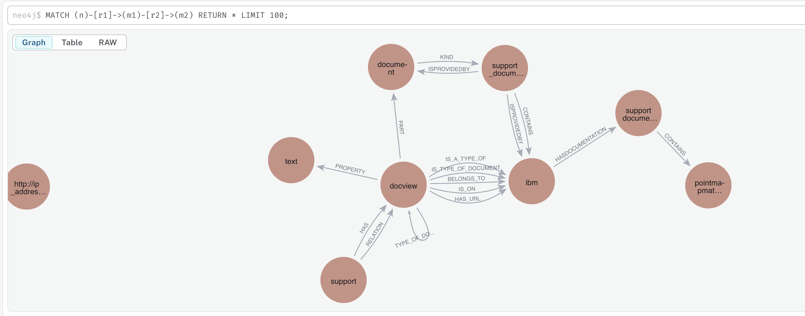
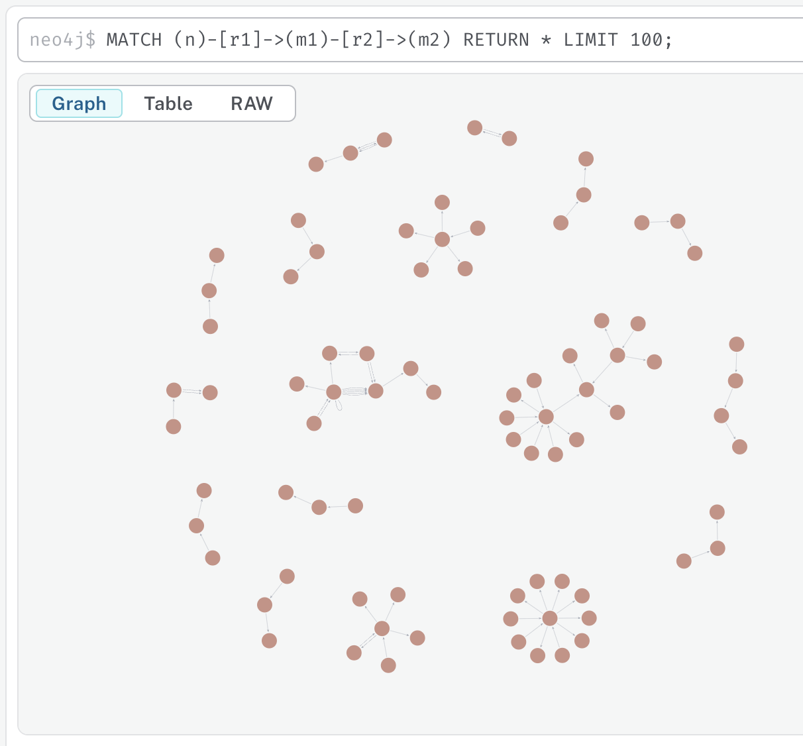

The majority of the code under `/lecture_corpus_txt2kg_nvidia` is copied from PyG Lecture Corpus example: https://github.com/pyg-team/pytorch_geometric/blob/2.7.0/examples/llm/txt2kg_rag.py, with modifications to integrate it with Neo4j.

This example illustrates how the PyG LLM txt2kg_rag can be use with Neo4j. The usage of Neo4j is basic, as a disk-based graph storage. More work to tightly couple Neo4j with PyG `data.FeatureStore` and `data.GraphStore` is in progress.


This Lecture corpus example, with a text-to-KG component, is entirely separate from the STaRK-Prime GRetriever example in the repository.


### Installations
1. `pip install -r requirements.txt`
2. Install pyg_lib for your Pytorch and CUDA version following https://github.com/pyg-team/pyg-lib.


### Starting the Neo4j DB
1. Start your Neo4j database. For example
```
(base) sbr@brians-gpu-usc1:~/neo4j-enterprise-5.26.4/bin$ ./neo4j start
```
2. Create a new `lecturecorpus` database with `CREATE DATABASE lecturecorpus IF NOT EXISTS`. You can check it is created with:
```
neo4j@neo4j> :use lecturecorpus
neo4j@lecturecorpus> MATCH (n) RETURN count(n);
```
3. Edit `lecture_corpus.env` to add your Neo4j credentials.


### Starting Nvidia NIM
Follow the instructions below to create an API key and create a local Nivida NIM service
1. Nvidia Docker: https://docs.nvidia.com/datacenter/cloud-native/container-toolkit/latest/install-guide.html#installation
2. Start Nvidia NIM on local machine: https://build.nvidia.com/nvidia/llama-3_1-nemotron-nano-4b-v1_1/deploy

For reproducing the benchmark results, you need to use `nvidia/llama-3.1-nemotron-ultra-253b-v1`.
For proof of concepts on smaller GPUs (e.g a single A100 40G), you can choose `nvidia/llama-3_1-nemotron-nano-4b-v1_1`.


### The example lecture corpus KG
A fragment of the generated lecture corpus KG looks like:




### Running the script
`python txt2kg_rag.py --NV_NIM_KEY=$YOUR_KEY --ENDPOINT_URL=http://0.0.0.0:8000/v1 --NV_NIM_MODEL nvidia/Llama-3.1-Nemotron-Nano-4B-v1.1 —-use_x_percent_corpus=0.1 --llm_generator_name=meta-llama/Llama-3.2-1B-Instruct`

Make sure to set `—use_x_percent_corpus` and `--llm_generator_name` for proof-of-concept using a small fraction of the dataset and a small model.
The entire end-to-end pipeline for PoC with these configurations takes about ~3h on a single A100 40G GPU.

For best end-to-end GraphRAG performance, use the default models on the full dataset in a large GPU cluster.